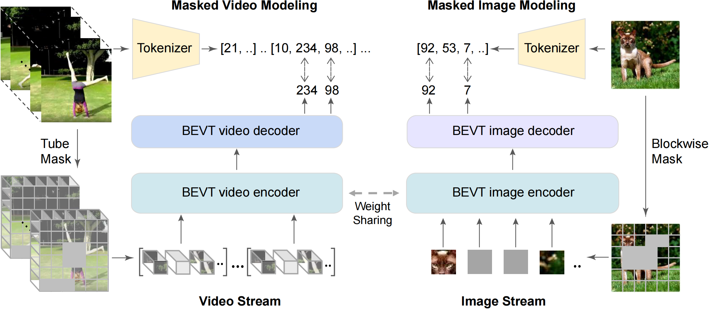

# BEVT: BERT Pretraining of Video Transformers

Rui Wang<sup>1</sup>, Dongdong Chen<sup>2</sup>, Zuxuan Wu<sup>1</sup>, Yinpeng Chen<sup>2</sup>, Xiyang Dai<sup>2</sup>, Mengchen Liu<sup>2</sup>, Yu-Gang Jiang<sup>1</sup>, Luowei Zhou<sup>2</sup>, Lu Yuan<sup>2</sup> <br>
<sup>1</sup>Shanghai Key Lab of Intelligent Info. Processing, School of Computer Science, Fudan University, <sup>2</sup>Microsoft Cloud + AI

> This repository hosts the official PyTorch implementation of the paper: "[**BEVT: BERT Pretraining of Video Transformers**](https://arxiv.org/abs/2112.01529)".

## Abstract

This paper studies the BERT pretraining of video transformers. It is a straightforward but worth-studying extension given the recent success from BERT pretraining of image transformers. We introduce BEVT which decouples video representation learning into spatial representation learning and temporal dynamics learning. In particular, BEVT first performs masked image modeling on image data, and then conducts masked image modeling jointly with masked video modeling on video data. This design is motivated by two observations: 1) transformers learned on image datasets provide decent spatial priors that can ease the learning of video transformers, which are often times computationally-intensive if trained from scratch; 2) discriminative clues, i.e., spatial and temporal information, needed to make correct predictions vary among different videos  due to large intra-class and inter-class variations. We conduct extensive experiments on three challenging video benchmarks where BEVT achieves very promising results. On Kinetics 400, for which recognition mostly relies on discriminative spatial representations, BEVT achieves comparable results to strong supervised baselines. On Something-Something-V2 and Diving 48, which contain videos relying on temporal dynamics, BEVT outperforms by clear margins all alternative baselines and achieves state-of-the-art performance with a 71.4% and 87.2% Top-1 accuracy respectively.




## Main Results on Downstream Tasks

**Something-Something V2**

| Backbone |  Pretrain   | Tokenizer | acc@1 | #params | FLOPs | Views | config | model |
| :---: | :---: | :---: | :---: | :---: | :---: | :---: | :---: | :---: |
|  Swin-B  | ImageNet-1K + K400 |  DALL-E   |  70.6  |   89M   |  321G  |  1x3  |  [config](configs/recognition/swin/swin_base_patch244_window1677_bevt_finetune_ssv2.py)  | ToDo |
|  Swin-B  | ImageNet-1K + K400 |  PeCo     |  71.4  |   89M   |  321G  |  1x3  |  [config](configs/recognition/swin/swin_base_patch244_window1677_bevt_finetune_ssv2.py)  | ToDo |


**Kinetics-400**

| Backbone |  Pretrain   | Tokenizer | acc@1 | #params | FLOPs | Views | config | model |
| :---: | :---: | :---: | :---: | :---: | :---: | :---: | :---: | :---: |
|  Swin-B  | ImageNet-1K + K400 |  DALL-E   |  80.6  |   88M   |  282G  |  4x3  |  [config](configs/recognition/swin/swin_base_patch244_window877_bevt_finetune_k400.py)  | ToDo |
|  Swin-B  | ImageNet-1K + K400 |  PeCo     |  81.1<sup>*</sup>  |   88M   |  282G  |  4x3  |  [config](configs/recognition/swin/swin_base_patch244_window877_bevt_finetune_k400.py)  | ToDo |

**Note**:

- BEVT uses the visual tokenizer of pretrained VQ-VAE from [DALL-E](https://arxiv.org/abs/2102.12092) or [PeCo](https://arxiv.org/abs/2111.12710).
- PeCo is only pretrained on ImageNet1K and uses the same codebook size as in DALL-E.
- BEVT does not need labels during pretraining.
- <sup>*</sup> BEVT can achieve **81.5%** Top-1 accuracy on Kinetics-400 when using PeCo tokenizer for pretraining and finetuning for 100 epochs.  


## Usage

###  Installation

Please refer to [install.md](docs/install.md) for installation.

We use [apex](https://github.com/NVIDIA/apex.git) for mixed precision training by default.

###  Data Preparation

Please refer to [data_preparation.md](docs/data_preparation.md) for a general knowledge of data preparation.

We use Kinetics-400 annotation files [k400_val](https://github.com/SwinTransformer/storage/releases/download/v1.0.6/k400_val.txt), [k400_train](https://github.com/SwinTransformer/storage/releases/download/v1.0.6/k400_train.txt) from [Video Swin Transformer](https://github.com/SwinTransformer/Video-Swin-Transformer).


### BEVT Pretraining

Install DALL-E package before training:
```
pip install DALL-E
```

Download DALL-E tokenizer weight before training:
```shell
TOKENIZER_PATH=/path/to/save/dall_e_tokenizer_weight
mkdir -p $TOKENIZER_PATH
wget -o $TOKENIZER_PATH/encoder.pkl https://cdn.openai.com/dall-e/encoder.pkl
wget -o $TOKENIZER_PATH/decoder.pkl https://cdn.openai.com/dall-e/decoder.pkl
```

Set `tokenizer_path` in the config file. For example, `configs/recognition/swin/swin_base_patch244_window877_bevt_in1k_k400.py`:
```shell
tokenizer_path = '/path/to/save/dall_e_tokenizer_weight'
```

First, pretrain the image stream of BEVT (Swin-base) on ImageNet-1K (800 epochs). The pretrained model of image stream could be downloaded at [google drive](https://drive.google.com/file/d/1VHKAH9YA_VD8M8bfGp2Svreqv0iuikB6/view?usp=sharing).

Then pretrain two stream of BEVT on ImageNet-1K and K400 (initialized from swin transformer pretrained with the image stream) with 32 GPUs (150 epochs):

```shell
bash tools/dist_train.sh configs/recognition/swin/swin_base_patch244_window877_bevt_in1k_k400.py --work-dir OUTPUT/swin_base_bevt_twostream --cfg-options total_epochs=150 model.backbone.pretrained='/path/to/save/swin_base_image_stream_pretrain.pth' --seed 0 --deterministic
```

The pretrained model of BEVT could be downloaded at [google drive](https://drive.google.com/file/d/13pMnG1ylyyKmhx5MKNZvqe7jHtPMY9cy/view?usp=sharing).

### BEVT Finetuning

Finetune BEVT model on K400 with 8 GPUs:

```shell
bash tools/dist_train.sh configs/recognition/swin/swin_base_patch244_window877_bevt_finetune_k400.py --work-dir OUTPUT/bevt_finetune/swin_base_bevt_finetune_k400 --cfg-options model.backbone.pretrained='OUTPUT/swin_base_bevt_twostream/latest.pth' --seed 0 --deterministic --validate --test-best --test-last
```

Finetune BEVT model on SSv2 with 8 GPUs:

```shell
bash tools/dist_train.sh configs/recognition/swin/swin_base_patch244_window1677_bevt_finetune_ssv2.py --work-dir OUTPUT/bevt_finetune/swin_base_bevt_finetune_ssv2 --cfg-options model.backbone.pretrained='OUTPUT/swin_base_bevt_twostream/latest.pth' --seed 0 --deterministic --validate --test-best --test-last
```

## To Do
- [x] Release joint pretraining code
- [x] Release fine-tuning code  
- [x] Release pretrained model
- [ ] Release finetuned model
- [ ] Release image stream pretraining code

## Acknowledgements

This code is based on [mmaction2](https://github.com/open-mmlab/mmaction2) and [Video Swin Transformer](https://github.com/SwinTransformer/Video-Swin-Transformer).

## Citation

```
@inproceedings{wang2021bevt,
  title={BEVT: BERT Pretraining of Video Transformers},
  author={Wang, Rui and Chen, Dongdong and Wu, Zuxuan and Chen, Yinpeng and Dai, Xiyang and Liu, Mengchen and Jiang, Yu-Gang and Zhou, Luowei and Yuan, Lu},
  booktitle={CVPR},
  year={2022}
}

@article{dong2021peco,
  title={PeCo: Perceptual Codebook for BERT Pre-training of Vision Transformers},
  author={Dong, Xiaoyi and Bao, Jianmin and Zhang, Ting and Chen, Dongdong and Zhang, Weiming and Yuan, Lu and Chen, Dong and Wen, Fang and Yu, Nenghai},
  journal={arXiv preprint arXiv:2111.12710},
  year={2021}
}
```